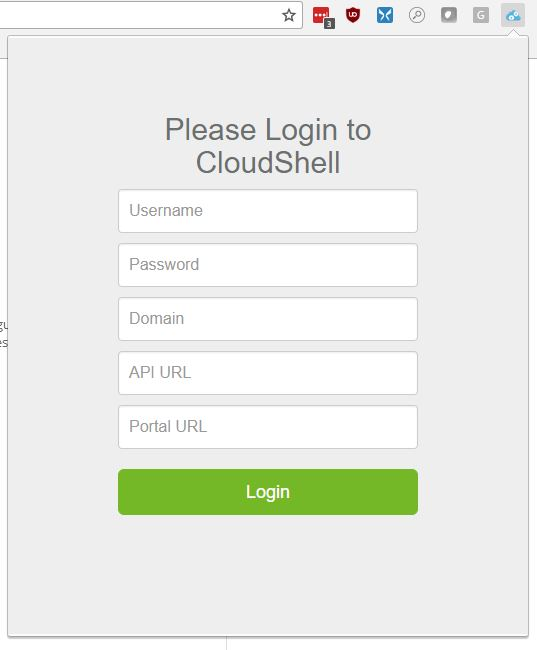
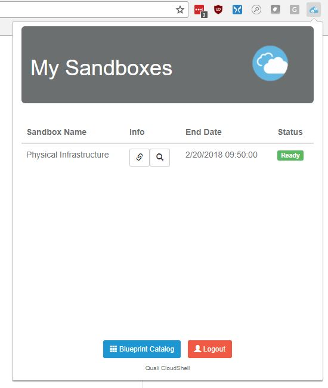

# CloudShell-Browser-Extension

## Background

This is a simple browser extension (Chrome and Edge) that let's you see your running sandboxes for a [CloudShell](https://www.quali.com/) install.

Permissions are set to need permissions "for every site" because the extension doesn't know the address of your CloudShell server ahead of time. Once I know how to solve this, I will restrict it further.

[However the source code is open source so feel free to browse it if you are concerned](https://github.com/graboskyc/CloudShell-Browser-Extension).

You can get the plugin using the folling links: [Chrome](https://chrome.google.com/webstore/detail/my-cloudshell/ldpfpoekjebmlglikmmebilfiomcmhme) and [Edge (not yet submitted but can load unpacked by following the developer documentation here)](https://docs.microsoft.com/en-us/microsoft-edge/extensions/guides/adding-and-removing-extensions).

The info the extension needs is as follows:
* Username - username to CloudShell
* Password - password to CloudShell
* Domain - the domain within CloudShell that you want to show active sandboxes in
* API URI - the CloudShell REST API endpoint (get this from your administrator) - no trailing slash but starts with http:// or https://
* Portal URI - the address of your CloudShell portal you log into - no trailing slash but starts with http:// or https://

## Screenshots
Login prompt:

View of running sandboxes:

Digging in to see contents of a running sandbox:

